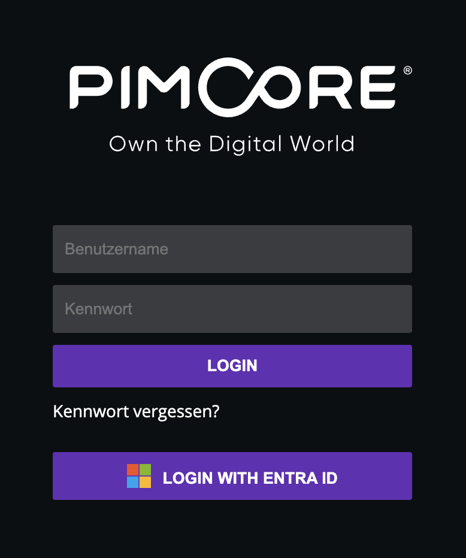

# Pimcore Single Sign-on

This bundle provides single-sign on support for Pimcore backend login. This allows to maintain user credentials and roles on external authenticatin providers. 

Delegate user management to an authentication provider has a lot of advantages:

- user only has to remember one password for all used services
- encryption and security is expected to be higher on those authentication providers as their whole business model highly depends on it
- administration has a single system where they can create users - so nobody has to create Pimcore accounts manually
- administration has a single system to disable users - when an employee leaves a company, you can disable all logins with a single click

Currently the bundle supports OpenID and LDAP authentication providers. Support for SAML and OAuth2 will come soon.

OpenID is supported by a [wide range of applications](https://openid.net/certification/) like

- Microsoft Azure Active Directory
- Auth0
- Google
- Okta
- and others

## How to get the plugin

You can buy this plugin in the [Blackbit Shop](https://shop.blackbit.com/pimcore-single-sign-on) or write an email to [info@blackbit.de](mailto:info@blackbit.de).

## Configuration

Configuration can be done directly in Pimcore backend (no need to edit YAML files):


The bundle gets shipped with detailed instructions how to set up auth applications at the authentication provider, where to find the necessary keys / settings and where to paste those secrets in Pimcore.

You can add as many auth providers as you want (e.g. if your internal users use a different auth provider as your Pimcore agency).

You can also configure default roles for each authentication provider. Those rules will get applied to newly created users. If an existing user logs in the default roles will not get applied.

## Pimcore backend login

### Single sign on as an optional login method

For each authentication provider (except for LDAP providers) a new button will be added to Pimcore's login screen:



After the user clicks this button, he will get redirected to the authentication provider. There he can log in (or perhaps already is logged in). Afterwards he will get redirected to your Pimcore and logged in. Internally a usual Pimcore user will get created based on the information of the authentication provider (e.g. username, email, roles).

### Single sign on as default login method

You can configure one authentication provider to be the default one. When this is done and a not logged-in user accesses `https://your-pimcore.com/admin` he will automatically get redirected to the authentication provider to login there. Afterwards he will get sent back to Pimcore backend being logged in.

### LDAP

For LDAP authentication providers no additional button gets added to the login screen but the normal login form gets used. With those credentials the LDAP provider gets requested and if the credentials are valid, the user gets logged in. Same as for other authentication types internally a usual Pimcore user will get created and the LDAP profile fields get applied (
e.g. username, email).

## Single-sign on for frontend applications

(The following instructions are only important if you want to add SSO to your Pimcore-based frontend application. If you only want to log in to Pimcore backend, the following section can be ignored.)

### Integration

To integrate single sign-on in frontend applications, you can add the following code in your Twig templates:

```twig
{{ 
  render(
    controller('Blackbit\\SingleSignOnBundle\\Controller\\IdentityController:frontendProvidersAction')
  )
}}
```

If you want to get auth provider data as JSON, please use `json` parameter with value `true`. If `json` not provided, buttons will be shown as html.

```twig

  {{  
    render(
      controller('Blackbit\\SingleSignOnBundle\\Controller\\IdentityController:frontendProvidersAction', { 'json': true }
      )
    )
  }}

window.location.href = {{ path('sso_frontend_redirect', {'provider': authProviders[0].name }) }};
```

Furthermore you can set `redirectUrl` parameter to redirect user after successful login. If `redirectUrl` is not provided, the user will get redirected to the requested page - if this is not available (because the login page was called without referer), it will redirect to default URL `/` (start page).

```twig
{{  
  render(
    controller('Blackbit\\SingleSignOnBundle\\Controller\\IdentityController:frontendProvidersAction', { 'json': false, 'redirectUrl': '/en/test' }
    )
  )
}}
```

### Event for successful login

You can subscribe to the event `sso.logged-in` which gets triggered upon successful frontend login. This event provides a `Pimcore\Model\User` object. You can modify its data or even exchange the whole object. This event will be triggered only for frontend authorization.

For example, in `services.yaml` register your event subscriber

```
App\EventListener\SsoLoginListener:
    tags:
        - { name: kernel.event_listener, event: sso.logged-in, method: onSuccessLogin }
```

Then create `SsoLoginListener` class in `src\EventListener` folder with following code:

```php
namespace App\EventListener;

use Pimcore\Model\User;
use Symfony\Component\EventDispatcher\GenericEvent;

class SsoLoginListener {
    public function onSuccessLogin (GenericEvent $e) {
        /** @var User $user */
        $user = $e->getArgument('user');
        
        // change user data
        $user->setEmail('test@example.org');
        
        // or even use a user object of a different class
        $user = \Pimcore\Model\DataObject\CustomUser::getByUsername($user->getUsername());
        $e->setArgument('user', $user);
    }
}
```

### Authorization check

To check if a user is logged in, you can use the `SingleSignOnTrait` in your controller:

```php
class MyController {
  use \Blackbit\SingleSignOnBundle\Controller\SingleSignOnTrait;
  
  public function myAction(\Symfony\Component\HttpFoundation\Request $request) {
    try {
        $this->guardLoggedIn($request);
    } catch(\Exception $e) {
        return $this->redirectToRoute('login'); // customize the route name for the login page here
    }
  }
}
```

### Logout

For logout you can use the `SingleSignOnTrait`:

```php
class MyController {
  use \Blackbit\SingleSignOnBundle\Controller\SingleSignOnTrait;
  
  public function logoutAction(\Symfony\Component\HttpFoundation\Request $request) {
    $this->logout($request);
    
    return $this->redirectToRoute('login'); // customize the route name for the logout page here
  }
}
```